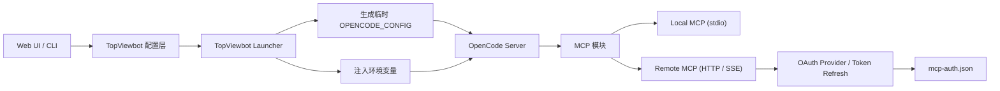
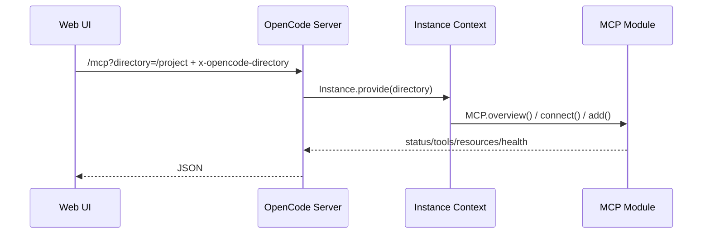
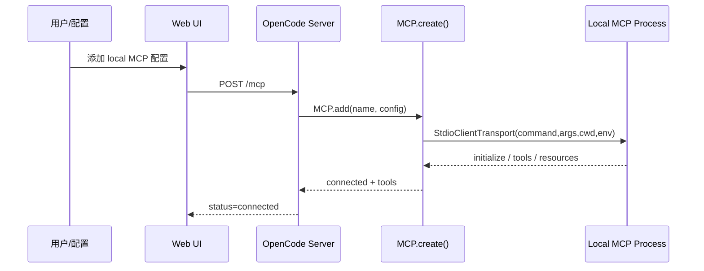
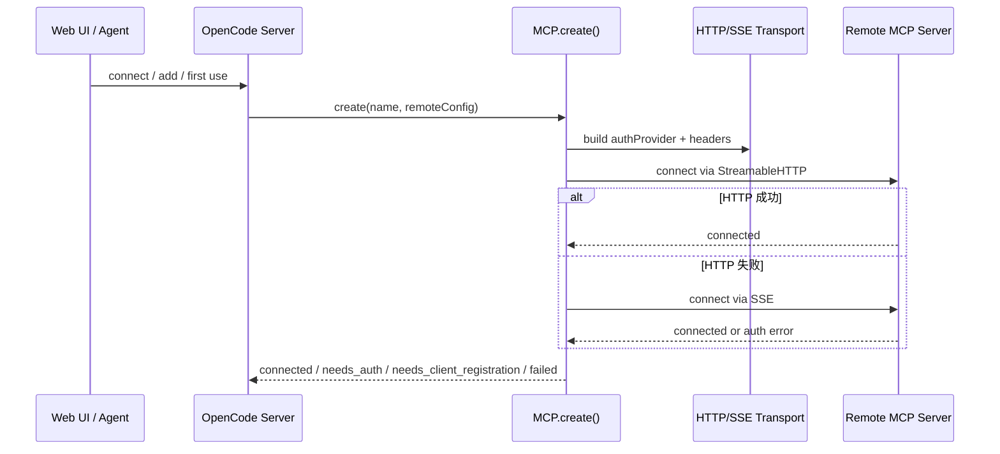
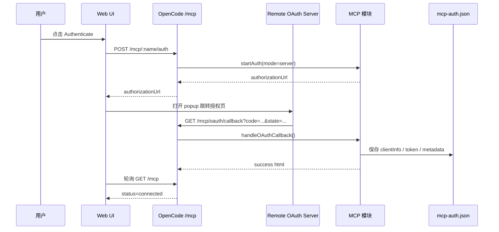

# TopViewbot MCP 接入与 OAuth 机制分析

## 1. 这套 MCP 到底是怎么分层的

先说结论：

- `topviewbot` 负责用户配置、配置持久化、Web UI、运行时注入环境变量。
- `opencode` 负责真正的 MCP 客户端实现，包括：
  - local stdio MCP 连接
  - remote Streamable HTTP / SSE 连接
  - OAuth 状态机
  - token 刷新
  - 将 MCP tools 包装成模型可调用工具
- 所以它不是“配置存储在 topviewbot 还是 opencode”二选一，而是：
  - 持久化配置主要在 `topviewbot`
  - 运行时执行主要在 `opencode`



## 2. 配置文件和认证文件到底用的是哪个

### 2.1 TopViewbot 自己的主配置

TopViewbot 自己定义了两层配置：

- 全局配置：`~/.config/topviewbot/config.jsonc`
- 项目配置：项目根目录向上查找的 `topviewbot.config.jsonc` 或 `topviewbot.config.json`

优先级从低到高：

1. `~/.config/topviewbot/config.jsonc`
2. `topviewbot.config.jsonc`

也就是说，当你在 TopViewbot 中“正式配置一个 MCP server”时，默认应该认为配置来源是 TopViewbot 的配置体系，而不是 `opencode/` 子目录。

对应实现：

- `packages/topviewbot/src/config/loader.ts`
- `packages/topviewbot/src/config/schema.ts`

### 2.2 运行时真正给 opencode 读的配置

TopViewbot 启动 server 时，会把自己的配置裁剪、转换成 opencode 能识别的格式，然后写入一个临时文件：

- `/tmp/topviewbot/opencode.config.json`

然后通过环境变量传给 opencode：

- `OPENCODE_CONFIG=/tmp/topviewbot/opencode.config.json`

这个临时文件是运行时配置源，不是用户长期维护的配置源。

所以这里要区分：

- 你平时编辑的是 `topviewbot.config.jsonc`
- opencode 启动后实际读到的是转换后的临时 `opencode.config.json`

### 2.3 OAuth / token 存储文件

TopViewbot 在启动 opencode 时，会显式覆盖认证存储路径：

- Provider auth：`~/.local/share/topviewbot/auth.json`
- MCP OAuth auth：`~/.local/share/topviewbot/mcp-auth.json`
- 项目环境变量目录：`~/.local/share/topviewbot/project-env`

因此在 TopViewbot 环境下，MCP OAuth 凭证主写入：

- `~/.local/share/topviewbot/mcp-auth.json`

不是默认的 opencode 数据目录。

不过 `opencode/src/mcp/auth.ts` 仍然保留了向后兼容逻辑：

- 如果存在旧的 opencode `mcp-auth.json`，读取时会合并旧文件和新文件
- 但新的主写入目标优先走 `TOPVIEWBOT_MCP_AUTH_PATH`

### 2.4 opencode 自己还会读哪些配置

如果没被 TopViewbot 禁掉继承，opencode 还会继续加载这些来源：

1. 远程 `/.well-known/opencode`
2. `~/.config/opencode/*`
3. 项目里的 `opencode.jsonc` / `opencode.json`
4. 项目里的 `.opencode/opencode.jsonc` / `.opencode/opencode.json`
5. `OPENCODE_CONFIG`
6. `OPENCODE_CONFIG_CONTENT`

所以最终生效配置并不只来自 TopViewbot。

## 3. TopViewbot 对 MCP 的配置格式

TopViewbot 对 MCP 配置的 schema 在：

- `packages/topviewbot/src/config/schema.ts`

支持三类内容：

### 3.1 local MCP

```jsonc
{
  "mcp": {
    "my-local-server": {
      "type": "local",
      "command": ["npx", "-y", "@some/mcp-server"],
      "environment": {
        "FOO": "bar"
      },
      "enabled": true,
      "timeout": 30000
    }
  }
}
```

### 3.2 remote MCP

```jsonc
{
  "mcp": {
    "my-remote-server": {
      "type": "remote",
      "url": "https://mcp.example.com/http",
      "headers": {
        "X-API-Key": "xxx"
      },
      "oauth": {
        "clientId": "optional-static-client-id",
        "clientSecret": "optional-secret",
        "scope": "read write"
      },
      "enabled": true,
      "timeout": 30000
    }
  }
}
```

### 3.3 只改 enabled

```jsonc
{
  "mcp": {
    "some-server": {
      "enabled": false
    }
  }
}
```

这种写法更多用于覆盖已有继承配置的开关状态。

## 4. MCP 的各种“继承”是怎么设计的

TopViewbot 在 MCP 这块做了两层继承控制：

### 4.1 TopViewbot 配置层的继承标志

在 `mcp` 下定义：

```jsonc
{
  "mcp": {
    "inheritOpencode": true,
    "inheritClaudeCode": true
  }
}
```

含义：

- `inheritOpencode`
  - 是否继承 opencode 自己的 MCP 配置来源
  - 包括 `~/.config/opencode`、项目 `opencode.json[c]`、`.opencode/*`
- `inheritClaudeCode`
  - 是否继承 Claude Desktop 配置中的 `mcpServers`

### 4.2 启动时如何生效

TopViewbot Launcher 会把这些继承控制转成环境变量：

- `OPENCODE_DISABLE_OPENCODE_MCP=true`
- `OPENCODE_DISABLE_CLAUDE_CODE_MCP=true`

也就是说，TopViewbot 不会自己重新实现一套 MCP 继承器，而是通过 env flag 控制 opencode 的加载行为。

### 4.3 Claude Desktop MCP 的继承来源

如果没禁用，opencode 会去读 Claude Desktop 配置：

- macOS: `~/Library/Application Support/Claude/claude_desktop_config.json`
- Linux: `~/.config/Claude/claude_desktop_config.json`
- Windows: `%APPDATA%/Claude/claude_desktop_config.json`

然后把：

```json
{
  "mcpServers": {
    "foo": {
      "command": "xxx",
      "args": ["a", "b"],
      "env": {}
    }
  }
}
```

转换成 opencode/TopViewbot 可用的 local MCP：

```json
{
  "foo": {
    "type": "local",
    "command": ["xxx", "a", "b"],
    "environment": {},
    "enabled": true
  }
}
```

### 4.4 最终生效 MCP 配置的心智模型

可以把最终配置理解成：

```text
远程 well-known
  -> opencode global config
  -> Claude Desktop MCP
  -> TopViewbot 生成的 OPENCODE_CONFIG
  -> project opencode config（若未禁用）
  -> OPENCODE_CONFIG_CONTENT（若有）
```

但注意一点：

- TopViewbot 在启动时把自己的 MCP 配置写进 `OPENCODE_CONFIG`
- TopViewbot 的 hot reload 又会直接监听 `~/.config/topviewbot/config.jsonc` 和项目 `topviewbot.config.jsonc`
- 所以从用户视角，真正应该维护的是 TopViewbot 配置

## 5. 整个请求是怎么包装的

### 5.1 Web 请求到项目上下文

前端会把当前目录作为：

- query 参数 `directory`
- request header `x-opencode-directory`

一起发给后端。

后端收到请求后，会把这个目录塞进 `Instance.provide({ directory })`，后续：

- 配置解析
- local MCP 启动 cwd
- session prompt
- tool 调用

都会运行在这个目录上下文里。



### 5.2 前端对 `/mcp` 的调用

TopViewbot Web 主要使用这些接口：

- `GET /mcp`：列状态
- `POST /mcp`：动态添加
- `DELETE /mcp/:name`：删除
- `POST /mcp/:name/connect`：连接
- `POST /mcp/:name/disconnect`：断开
- `POST /mcp/:name/auth`：启动 OAuth
- `DELETE /mcp/:name/auth`：清理 OAuth
- `POST /mcp/:name/health`：健康检查

这些接口本身只是薄薄一层，真正逻辑全部下沉到 `opencode/src/mcp/index.ts`。

## 6. Local MCP 是怎么运作的

这一部分最重要的结论是：

- local MCP 不走 OAuth
- local MCP 的本质是“当前项目目录下启动一个 stdio 子进程，然后通过 MCP SDK 连上去”

### 6.1 local MCP 建连流程



### 6.2 local MCP 的关键细节

- transport 使用 `StdioClientTransport`
- `cwd` 不是固定目录，而是当前请求对应的 `Instance.directory`
- `environment` 会把当前 `process.env` 和 MCP 自己的 `environment` 合并
- 如果命令本身启动失败，会直接进入 `status=failed`

### 6.3 local MCP 的运行时状态

连接成功后，MCP 模块会拉取：

- `listTools()`
- `listResources()`

并把这些东西缓存到内存状态中。之后模型能直接把这些 tools 当作普通 tool 调用。

## 7. Remote MCP 是怎么运作的

remote MCP 的本质是：

- 通过 MCP SDK 对远端 MCP endpoint 建 client
- transport 会依次尝试：
  - `StreamableHTTPClientTransport`
  - `SSEClientTransport`

### 7.1 remote MCP 不一定需要 OAuth

remote MCP 有三种典型模式：

1. 纯 headers 鉴权
2. OAuth
3. headers + OAuth 混合

如果你配置了：

```jsonc
{
  "oauth": false
}
```

则显式关闭 OAuth，只按普通 remote 连接处理。

如果没写 `oauth: false`，remote MCP 默认认为“支持 OAuth 能力”。

### 7.2 remote MCP 建连流程



### 7.3 建连后的工具包装

一旦 remote MCP 连接成功，系统会：

1. `listTools()`
2. 把每个 MCP tool 包装成 AI SDK 的 `dynamicTool`
3. 以 `serverName_toolName` 形式暴露给模型

所以从模型视角看：

- 它不是直接“懂 MCP”
- 而是通过 opencode 把 MCP tool 再封成模型可调用 tool

## 8. MCP OAuth 是怎么运作的

这是你最关心的部分，可以分成四层理解：

1. 什么时候认为需要 OAuth
2. OAuth client 是静态注册还是动态注册
3. 回调走哪里
4. token 存哪里、什么时候刷新

### 8.1 什么时候触发 OAuth

remote MCP 在建连时，如果 transport 返回认证错误，会进入：

- `needs_auth`
- 或 `needs_client_registration`

然后系统决定是否启动 OAuth 流程。

另外，如果模型在真正 `callTool()` 时撞到鉴权错误，也会触发重新连接和交互认证。

### 8.2 OAuth client 的两种模式

#### 模式 A：静态 client registration

你手动在配置里提供：

```jsonc
{
  "oauth": {
    "clientId": "...",
    "clientSecret": "...",
    "scope": "..."
  }
}
```

这意味着：

- `clientId/clientSecret` 来自配置文件
- 系统不会依赖动态注册
- 比较适合企业平台、固定 app 注册场景

#### 模式 B：动态 client registration

如果你没有写 `clientId`，`McpOAuthProvider.clientInformation()` 会先尝试读取本地保存的动态注册信息：

- 如果本地没有，就让 MCP/OAuth SDK 去做动态 client registration
- 如果远端服务不支持动态注册，就进入 `needs_client_registration`

所以这里的本质判断是：

- 有 `clientId`：走静态注册
- 没 `clientId`：优先走动态注册

### 8.3 OAuth 的两种回调模式

#### 模式 A：loopback 模式

用于本机交互，例如 CLI 或服务端直接弹浏览器。

回调地址：

- `http://127.0.0.1:19876/mcp/oauth/callback`

流程：

1. 本地起一个临时 callback server
2. 打开浏览器到授权页
3. 浏览器授权完成后回调到本机端口
4. 本地进程拿到 `code`
5. 完成 token 交换

#### 模式 B：server 模式

用于 TopViewbot Web UI。

回调地址：

- `http(s)://你的-topviewbot-server/mcp/oauth/callback`

流程：

1. Web UI 调 `POST /mcp/:name/auth`
2. 后端 `startAuth(mode="server")`
3. 返回授权 URL
4. 前端 `window.open(url)`
5. 浏览器授权完成后重定向回 TopViewbot 的 `/mcp/oauth/callback`
6. 后端处理 callback，完成 token 交换
7. 前端轮询 `/mcp` 状态直到 `connected`

### 8.4 Web UI 下的 OAuth 时序



### 8.5 OAuth 的内部关键状态

在 OAuth 流程中，系统会维护：

- `oauthState`
- `codeVerifier`
- `clientInfo`
- `tokens`
- `issuer`
- `authorizationEndpoint`
- `tokenEndpoint`
- `registrationEndpoint`
- `lastAuthError`

它们都保存在 `mcp-auth.json` 的对应 server 条目里。

### 8.6 token 刷新机制

`McpOAuthProvider.tokens()` 会先检查：

- token 是否过期
- token 是否接近过期

如果接近过期并且有 `refreshToken`，就会：

1. 去 `/.well-known/oauth-authorization-server` 拉 metadata
2. 找到 `token_endpoint`
3. 发起 refresh token 请求
4. 成功后写回新 token

如果刷新失败：

- `invalid_client`：清理 token 和 clientInfo
- `invalid_grant / reauth_required / insufficient_scope`：清理 token

这样下次连接时会重新进入认证流程。

### 8.7 state 校验与安全设计

回调时系统强制校验：

- 必须带 `state`
- `state` 必须存在于待处理会话里

否则直接判为：

- 缺失 state
- 非法或过期 state
- 潜在 CSRF

这是这套 OAuth 流程里最核心的安全边界之一。

## 9. “添加一个 MCP 服务”时，你应该怎么判断走哪条链路

### 9.1 如果你添加的是 local MCP

你应该关注：

1. `type` 是否是 `local`
2. `command` 能否在当前机器执行
3. 当前 session/project 的 `directory` 是什么
4. 是否需要通过 `environment` 注入密钥
5. 这个 server 本身是否正确走 stdio MCP 协议

你不需要关注：

- OAuth
- `mcp-auth.json`
- callback 路由

### 9.2 如果你添加的是 remote MCP，但只是 API key / headers

你应该关注：

1. `type` 是否是 `remote`
2. `url` 是否正确
3. `headers` 是否足够
4. 是否要显式写 `oauth: false`

如果你的远端服务只支持 header/token，不需要 OAuth，建议明确写：

```jsonc
{
  "oauth": false
}
```

这样可以避免系统误判成 OAuth capable remote server。

### 9.3 如果你添加的是 remote MCP，并且要 OAuth

你应该关注：

1. 服务端是否支持动态 client registration
2. 如果不支持，是否需要手动配置 `clientId`
3. 回调场景是 Web UI 还是本机 loopback
4. token 会保存在 `~/.local/share/topviewbot/mcp-auth.json`
5. 如果服务端 URL 改了，旧 token 会被视为无效

### 9.4 推荐判断表

| 场景 | type | 是否走 OAuth | 关注点 |
| --- | --- | --- | --- |
| 本地命令型 MCP | `local` | 否 | `command`、`cwd`、`environment` |
| 远端 + API Key | `remote` | 否或应显式禁用 | `url`、`headers`、`oauth: false` |
| 远端 + 浏览器授权 | `remote` | 是 | `oauth`、回调地址、token 存储 |
| 企业远端 + 预注册 client | `remote` | 是 | `clientId/clientSecret/scope` |

## 10. 配置修改后如何生效

TopViewbot 在 MCP 这块不只是“重启后生效”，它还实现了热更新：

- 监听 `~/.config/topviewbot/config.jsonc`
- 监听项目 `topviewbot.config.jsonc`
- 每 30 秒检查一次

如果检测到 MCP 配置变化，就会：

1. 新增新 server
2. 重新连接配置已变的 server
3. 移除被删除的 server

所以从维护体验上说：

- 正式配置写 TopViewbot 配置文件
- opencode 临时 config 负责当前进程运行时读取
- hot reload 负责把文件变化同步到已运行的 MCP 状态

## 11. 一句话总结整套设计

这套设计的核心不是“把 MCP 重新实现一遍”，而是：

- TopViewbot 作为外层产品壳，统一管理自己的配置体系、UI、目录上下文和认证存储
- opencode 作为内层执行引擎，负责真正的 MCP transport、OAuth、tool 包装和连接管理
- 二者通过：
  - `OPENCODE_CONFIG`
  - `TOPVIEWBOT_*` 环境变量
  - `/mcp` HTTP 路由
  - `Instance.provide(directory)`

连接在一起

因此在理解和排查问题时，最有效的方式是分三层看：

1. TopViewbot 配置层：你到底配了什么、写到哪了
2. opencode 运行层：它最终读到了什么配置
3. MCP/OAuth 执行层：它到底是 local 建连失败、remote 认证失败，还是 token 刷新失败

## 12. 关键源码索引

### TopViewbot 配置与启动

- `packages/topviewbot/src/config/loader.ts`
- `packages/topviewbot/src/config/schema.ts`
- `packages/topviewbot/src/launcher/server.ts`

### Web UI MCP 交互

- `web/src/api/client.ts`
- `web/src/components/McpProjectPanel.vue`
- `web/src/composables/useSettings.ts`

### OpenCode MCP 核心

- `opencode/packages/opencode/src/server/server.ts`
- `opencode/packages/opencode/src/server/routes/mcp.ts`
- `opencode/packages/opencode/src/mcp/index.ts`
- `opencode/packages/opencode/src/mcp/auth.ts`
- `opencode/packages/opencode/src/mcp/oauth-provider.ts`
- `opencode/packages/opencode/src/mcp/oauth-callback.ts`
- `opencode/packages/opencode/src/mcp/hot-reload.ts`
- `opencode/packages/opencode/src/config/config.ts`
- `opencode/packages/opencode/src/config/claude-mcp.ts`

